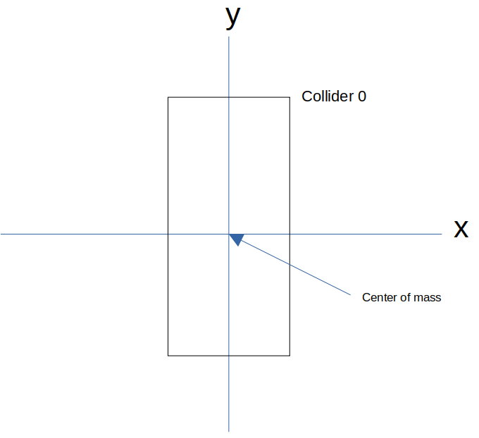
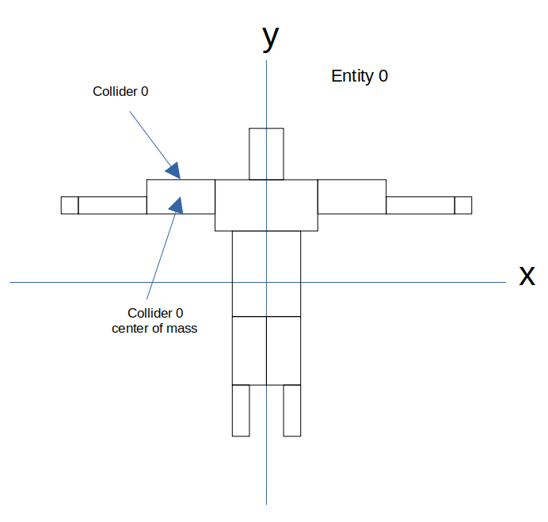
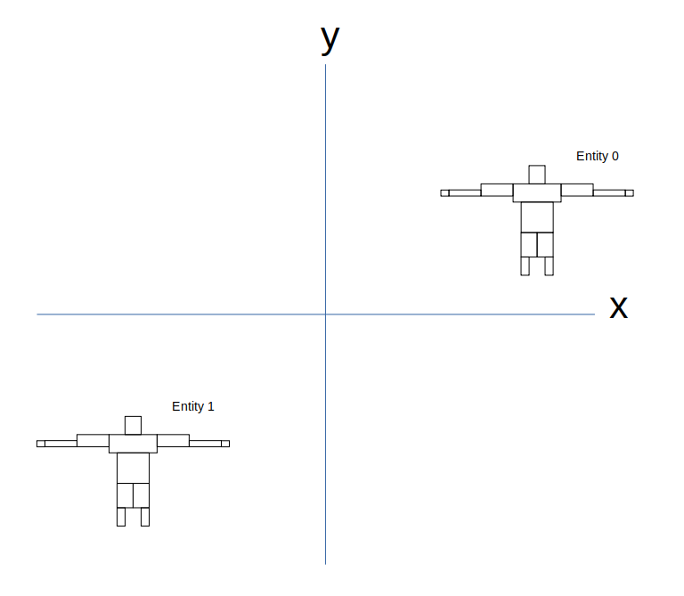

# Model loading and instancing
## Motivation and Introduction
The entire purpose of the engine is based around the manipulation of objects in 3D space. It is very convenient to import premade 3D models with mesh, animation and physics data to represent these objects when rendered to the screen. With this, inevitably comes the instance where a program utilizes multiple instances of a singular 3D model, say a simple character mesh, for purposes such as a physics simulation. These characters will have identical 3D models, animations and hitboxes, but should have the ability to have differing spatial positions, animation state, and physical properties. As such, a system must be devised to separate information that is uniform across all simulated objects represented by the same model, and object specific information.

These individual objects are referred to as **entities** by the engine, and they can be thought of as instances of **models**, which contain the entity's essential, unchanging information.

Each **entity** in the world has their own:
- Spatial attributes (position, rotation, scale)
- Skeletal bone orientations
- Physical properties

While each **model** contains:
- Mesh data
- Available animations
- Hitboxes
- Bone structure

With this structure, objects that are all instances of the same 3D model do not have to needlessly hold an instance of repetitive mesh information, and instead, only need to maintain information that is exclusive to the state of that object.

Furthermore, There are three distinct coordinate systems that arise from such a system: **bone space**, **entity space** and **world_space**.

### Bone Space



Bone space describes the coordinate system wherein a colliders center of mass is the origin, and the bone is oriented arbitrarily around it.

### Entity Space



Entity space descibes the coordinate system in which the entity's model's mesh was developed. This means the entity's center is not always neccesarrily located in the origin, rather, it is an intermediate space used for describing the orientations of bones and colliders, given the current animation or physics effect. Can be thought of as "blender's coordinate system" (However, this categorization is not completely correct, as blender's axes are different from OpenGLs).

### World Space



Finally, world space describes the coordinate system of the overall scene, with the origin being an arbitrary focal point within the world. Entities are placed and rendered within world space, and much of physics is done in world space as well.

## The main structs

This section will specify the `ENTITY`, `MODEL` and their main supporting structs, which act as the backbone data structures for much of the engines functionality. These structures do not have to be understood in their entirety, as only a few members are worth manipulating for general usage. However, at least a very basic understanding of these structures can assist when working with systems such as [simulation](./simulation.md)

**note**: Several supporting structs and many stuct members are left out for brevitys sake, as their functionality is largely taken care of via supporting functions.

### The main structs

```MODEL```

- Misc animation data: A collection of members responsible for tracking the model's animations and keyframes. The only aspect of importance here, is understanding that a model's animations are stored in a buffer, and are indexed by the `animate()` function. See [animation](#animation)

- `BONE *bones`: Buffer of bones which make up the bone tree of the model, used for skeletal animation and ragdolls (WIP).

- `COLLIDER *colliders`: Buffer of colliders which make up the model. Can consist of multiple collider types, such as hit boxes, hurt-boxes, boxes used for physics, event triggering, etc...

- `int *collider_bone_links`: A buffer associating the index of a collider in `colliders` to a bone index in `bones`. However, not all colliders are guaranteed to be connected to associated with a bone, in which case, a -1 is stored. Multiple colliders may **not** be associated with the same bone.

- `int *bone_collider_links`: A buffer associating the index of a bone in `bones` to a collider index in `colliders`. Multiple bone's may be associated with a single collider. In the event these is no collider for a given bone, -1 is stored.

- `size_t num_bones`: Number of bones in `bones`

- `size_t num_colliders`: Number of colliders in `colliders`

- Misc mesh data: A collection of members responsible for storing the vertex info of the actual mesh for the model. These members include the model's vertex array object, vertex buffer object and element buffer object. These members may be ignored, as they are hidden by the [draw functions](#drawing).

**Important takeaways**:

- Models represent the unified collider, bone, animation and mesh information about a model

- The colliders and bones of a model give information about the bone-space and entity-space orientations of the mesh's colliders and bones, but no information about world-space

```ENTITY```

- `void *data`: A pointer to any arbitrary data for linking entities to application-specific systems

- Model matrix data: Collection of matrix members used for final render of the entity and its bones

- `MODEL *model`: Pointer to the model the entity is an instance of

- `P_DATA *np_data`: Array of `P_DATA` structs, reperenting the "narrow" physics data of each collider of the entity. This allows each collider to have its own physics properties, which can be used in features such as ragdolls.

- `mat4 inv_inertia`: The inverse of the inertia tensor which represents the *whole* entity. This represents a part of the entity's "broad" physics data, which is represntative of the entity as a whole, not just a single collider.

- `versor rotation`: The rotation quaternion of the entity.

- `vec3 scale`: The scale vector of the entity

- `vec3 translation`: The translation vector of the entity. Can be thought of as the position of the entity in world space

- `vec3 velocity`: The "broad" physics velocity vector of the entity

- `vec3 ang_velocity`: The "broad" physics angular velocity of the entity

- `vec3 inv_mass`: The "board" physics inverse of the entity's mass

- `int type`: A bitfield specifying the "type" of the entity and how it should be treated during simulation. The options are:
  - `T_DYNAMIC`: A flag used to denote that the entity is currently moving. When simulated, this flag is automatically updated by the simulation, and is used to save computation time.
  - `T_DRIVING`: A flag used to denote that the entity will "drive" movement. These entities tend to use "broad" physics data over "narrow" physics data. This is used to denote entities such as players, npcs, moving set pieces, etc, that can move due to factors other than collision. This flag is used by simulations to save computation time.
  - `T_IMMUTABLE`: A flag used to denote the entity should not be effected by physical forces or integration. Primarily used by permanant set pieces such as floors, buildings, etc...

**Important takeaways**:

- Entities can be thought of as "instances" of models, with their own world-space info that can be applied to their model's colliders and bones

- The main fields for manipulating an entity through space are the `rotation`, `translation`, and `scale` fields

- The main fields for manipulating an entity's physical attributes are the `inv_mass` and `inv_inertia` fields

- The `data` field acts as a linkage of the entity to external, application-specific systems, such as a `player` or `enemy` struct

```COLLIDER```

Colliders are unique in that their structure depends on their `type` due to the usage of a union to store their data.

- `int category`: A flag denoting the categorization of the collider. Used when deciding if the collider should be added to a simulation, given a collider filter, as seen [here](./simulation.md). The motivation for categorizing colliders is for the ability to create distinct simulations, each focusing on different collider types of the same entities, such as a combat-based simulation, which only looks at entity hurt-boxes and hit-boxes, and another event-detecting simulation, which only looks at the bounding colliders of an entity. The options are as follows:
  - `DEFAULT`: This can be thought of as the "bounding" box of an entity, and represents an entire entity rather than a single part of the entity. This is typically used in event-triggering and broad collision detection
  - `HURT_BOX`: This can be thought of as a collider for a singular bone/segment of the entity. This is typically used in "narrow" physics and combat simulation.
  - `HIT_BOX`: This is another more "narrow" colliders used to represent a segment of the entity that might actually deal damage. Typically used in combat simulation.
  - **note**: The assignment of these categories to a colliders is largely up to the developer, and does not have to perfectly follow the general descriptions above. i.e a collider assigned to be a `HIT_BOX` does not "have" to be used to deal damage, and a `HURT_BOX` can technically represent an entire entity. They are provided as they are purly because these types of categories are conducive to many game paradigms. However, the simulation will treat colliders of different categories differently. In particular:
    - If a bone is linked to a `HURT_BOX` of `HIT_BOX`, the simulation integration and impulse resolution function will only work with the collider's "narrow" physics info, NOT the broad physics info of the entity.
    - Similarly, if a collider is categorized as `DEFAULT`, the simulation will automatically work with "broad" physics and state info, regardless of if the collider is linked to a bone

- `COL_TYPE type`: The shape of the collider. The options are:
  - `POLY`: The collider is a polyhedron of 8 vertices
  - `SPHERE`: The collider is a sphere

- If `type` is `POLY`, `union data` has the following members:
  - `vec3 verts[8]`: List of the 8 verticies of the collider in bone space
  - `vec3 center_of_mass`: Center of mass of the collider in entity space

- If `type` is `SPHERE`, `union data` has the following members:
  - `vec3 center`: Center of the sphere in entity space
  - `float radius`: Radius of the sphere in bone space

```BONE```

- `mat3 coordinate_matrix`: Matrix to rotate bone-space vertices to entity space

- `vec3 head`: "head" of the bone in entity space

- `vec3 tail`: "tail" of the bone in entity space

- Misc relationship info: Members linking the bone to its parent and children

```P_DATA```

- Misc ragdoll physics members: A collection of members used only for usage in the WIP ragdoll simulation. Can be safely ignored.

- `vec3 velocity`: Velocity of the collider

- `vec3 ang_velocity`: Angular velocity of the collider

## Loading

A model can be loaded via the `load_model` function. These models are read from modified .obj files. These files are similar in format to Wavefront .obj files. However, they are expanded to contain bone, animation and collider data. These files may be exported from blender utilizing a [custom python script](https://github.com/Jack-Saysana/Blender-Custom-Obj-Exporter). These files are preprocessed by the engine to create a model binary, which contains the same information as these .obj files, but may be read at much faster speeds in the future. However, the binaries are not guarenteed to be portable across systems.

### Functions

####```MODEL *load_model(char *path)```

Loads a model from a modified .obj file. If no preprocessed binary of the same name with a ".bin" extention exists in the directory in which the .obj file resides, the engine will also preprocess the file and create a preprocessed binary for quick reading.

**Arguments**

- `char *path`: path to the model's .obj file

**Returns**

A pointer to the imported model or NULL if an error has occured.

## Instancing

Once imported, models can be instanced to create "entities" with their own animation, physics and spatial state. These entities can then be entered into physical simulations for more complex scenes.

### Functions

####```ENTITY *init_entity(MODEL *model)```

Creates an instance of a model with its own animation, physics and spatial state.

**Arguments**

- `MODEL *model`: Pointer to the model to be instanced

**Returns**

A pointer to the new entity instance or NULL if an error has occured

## Animation

Given an entity's model is properly rigged and contains animations, an entity's animations can be easily depicted in-engine.

### Functions

####```int animate(ENTITY *entity, unsigned int animation_index, unsigned int frame)```

Manipulates an entity's bone matricies such that they display a given frame of a given animation.

**Arguments**

- `ENTITY *entity`: Entity to animate

- `unsigned int animation_index`: Index of entity animation to use. The index of the animation is in accordance to the order in which the animations were exported.

- `unsigned int frame`: The current frame of the animation to select

**Returns**

0 if successful, -1 if invalid arguments

## Drawing

Both the ENTITY and MODEL type can be rendered to the screen via their respective draw functions. Furthermore, debugging draw functions are also provided to render entity data such as colliders and bones.

To learn about quickly importing the shaders to use during render, refer to [this page](./shaders.md).

### Functions

####```void draw_model(unsigned int shader, MODEL *model)```

Draws a model to the screen. By default, the mesh will be rendered as it appears straight from the binary file, so the matricies used to render the model must be manually set.

**Arguments**

- `unsigned int shader`: The ID of the shader program used to render the model
  - The model has the following VBO structure which should be reflected in the shader:
    - layoutfloat vertex[3]: coordinate vertices
    - float normal[3]: vertex normal
    - float tex_coords[2]: texture coordinates
    - int bone_ids[4]: indicies of 4 (or less) bones which are bound to the vertex
      - Will be -1 if bone slot not used
    - float weights[4]: Corresponding weights of influence from each bone in `bone_ids`

- `MODEL *model`: Pointer to the model to be render

####```void draw_entity(unsigned int shader, ENTITY *entity)```

Draws an entity to the screen, using the model that was used to initialize the entity. The physics, general position, bone orientation, and transformation data is automatically applied to the model upon rendering the entity, so no model matricies must be manually set.

**Arguments**

- `unsigned int shader`: The ID of the shader program used to render the model
  - The model has the following VBO structure which should be reflected in the shader:
    - layoutfloat vertex[3]: coordinate vertices
    - float normal[3]: vertex normal
    - float tex_coords[2]: texture coordinates
    - int bone_ids[4]: indicies of 4 (or less) bones which are bound to the vertex
      - Will be -1 if bone slot not used
    - float weights[4]: Corresponding weights of influence from each bone in `bone_ids`

- `ENTITY *entity`: Pointer to the entity to render

## Cleanup

Upon concluding their usage, both entities and models must be deallocated with their respective functions.

### Functions

####```void free_model(MODEL *model)```

Deallocates a model

**Arguments**

`MODEL *model`: Pointer to model to be deallocated

####```void free_entity(ENTITY *entity)```

Deallocates an entity. Does **NOT** deallocate the model which the entity is an instance of.
