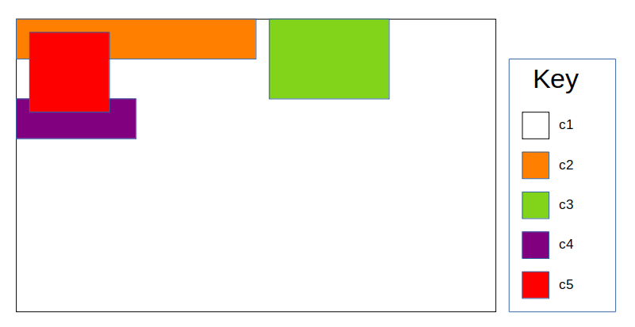

# UI Components
## Overview
The engine provides an interface for quickly creating and rendering custom UI meshes to build complex and interactive menus.

The UI system is hierarchical in nature, with all custom UI components extending from a single blank "root" UI component. The "root" UI component is an invisible box, taking up the width and height of the viewport.

The hierarchical nature of UI components mean every UI component is rendered in relation to it's parent component. This allows for the easy definition of common menu types like lists, grids, text boxes, etc. More info about the nuances of this hierarchical system can be found [below](#ui-component-options).

After initializing the UI module, custom UI components can then be created, edited and rendered. Some of the properties held by UI components are:

- positioning
- sizing
- event callbacks (on click, on hover, etc...)
- text
- ...

## Initialization

In order to use the UI component functionality, the `init_ui` function must be called **once** at the beginning of the application. This function is responsible for initializing the root ui component, compiling the UI shaders and allocating the buffers needed for backend functionality.

### Functions

### int init_ui(char *quad_path, char *ui_vs, char *ui_fs, char *text_vs, char *text_fs)

**Arguments:**

- `char *quad_path`: Path to quad model which will be used as the base object for rendering ui components.

- `char *ui_vs`: Path to the vertex shader which will be used for rendering ui components.

- `char *ui_fs`: Path to the fragment shader which will be used for rendering ui components.

- `char *text_vs`: Path to the vertex shader which will be used for rendering ui text.

- `char *text_fs`: Path to the fragment shader which will be used for rendering ui text.

**Returns:**

 0 if successful, -1 if failed to successfully prepare the UI module

#### Example

```
int main() {
  // Rest of your init code
  ...
  int status = init_ui("path/to/quad.obj", "path/to/ui.vs", "path/to/ui.fs",
                       "path/to/text.vs", "path/to/text.fs");
  if (status == -1) {
    exit(1);
  }
  ...
  // Main render loop
  while (rendering_scene) {
    ...
  }
  // Clean up code
  ...
}
```

## Creating UI Components

UI Components are primarily created with the `add_ui_comp()` function. Much of the UI component's functionality is set to default values, with the ability to further customize the component with the [editing functions](#editing-ui-components).

### UI Component options

An important aspect of creating UI Components is the `options` parameter. This bitfield specifies how the various UI attributes should be interpreted during rendering. Their are three main "options" to specify:

**1. Positioning**

This option specifies how the UI Component is positioned relative to their parent.

The options are as follows:

- **ABSOLUTE_POS**: This options will cause the UI Component's `position` attribute to act as an offset from the parent component's top left corner, no matter the position of sibling components.

- **RELATIVE_POS**: This option will cause the UI Component's `position` attribute to act as an offset from the automatic "best-fit" position inside the parent component, calculted during rendering.
  - This "best-fit" position will be calculated relative to sibling components. At render time, the renderer will fill the parent component with its relative children from left to right, bottom to top.

**2. Position units**

This option specifies the units for the UI Component's `position` attribute.

The options are as follows:

- **POS_X_UNIT_RATIO_X**: The x-coordinate of `position` is a decimal ratio of the parent component's width. (0.1 is 10% of parent's width, 1.0 is 100%, and so on...)

- **POS_X_UNIT_RATIO_Y**: The x-coordinate of `position` is a decimal ratio of the parent component's height. (0.1 is 10% of parent's height, 1.0 is 100%, and so on...)

- **POS_X_UNIT_PIXEL**: The x-coordinate of `position` is a pixel offset. (1.0 for 1px, 100.0 for 100px, ...)

- **POS_Y_UNIT_RATIO_X**: The y-coordinate of `position` is a decimal ratio of the parent component's width. (0.1 is 10% of parent's width, 1.0 is 100%, and so on...)

- **POS_Y_UNIT_RATIO_Y**: The y-coordinate of `position` is a decimal ratio of the parent component's height. (0.1 is 10% of parent's height, 1.0 is 100%, and so on...)

- **POS_Y_UNIT_PIXEL**: The y-coordinate of `position` is a pixel offset. (1.0 for 1px, 100.0 for 100px, ...)

- **POS_UNIT_RATIO_X**: Both coordinates of `position` are a ratio of the parent component's width
  - (equivalent to `POS_X_UNIT_RATIO_X | POS_Y_UNIT_RATIO_X`)

- **POS_UNIT_RATIO_Y**: Both coordinates of `position` are a ratio of the parent component's height
  - (equivalent to `POS_X_UNIT_RATIO_Y | POS_Y_UNIT_RATIO_Y`)

- **POS_UNIT_PIXEL**: Both coordinates of `position` are pixel offsets
  - (equivalent to `POS_X_UNIT_PIXEL | POS_Y_UNIT_PIXEL`)

- **POS_UNIT_RATIO**: The x-coordinate of `position` is a ratio of the parent component's width. The y-coordinate is a ratio of the parent component's height.
  - (equivalent to `POS_X_UNIT_RATIO_X | POS_Y_UNIT_RATIO_Y`)

**3. Size units**

This option specifies the units for the UI Component's `width` and `height` attributes.

The options are as follows:

- **WIDTH_UNIT_RATIO_X**: The UI Component's `width` is a ratio of the parent component's width. (0.1 is 10% of parent's width, 1.0 is 100%, and so on...)

- **WIDTH_UNIT_RATIO_Y**: The UI Component's `width` is a ratio of the parent component's height. (0.1 is 10% of parent's height, 1.0 is 100%, and so on...)

- **WIDTH_UNIT_PIXEL**: The UI Component's `width` is in units of pixels (1.0 for 1px, 100.0 for 100px, ...)

- **HEIGHT_UNIT_RATIO_X**: The UI Component's `height` is a ratio of the parent component's width. (0.1 is 10% of parent's width, 1.0 is 100%, and so on...)

- **HEIGHT_UNIT_RATIO_Y**: The UI Component's `height` is a ratio of the parent component's height. (0.1 is 10% of parent's height, 1.0 is 100%, and so on...)

- **HEIGHT_UNIT_PIXEL**: The UI Component's `height` is in units of pixels (1.0 for 1px, 100.0 for 100px, ...)

- **LINE_UNIT_RATIO_X**: The UI Component's text `line_height` is a ratio of the parent component's width. (0.1 is 10% of parent's width, 1.0 is 100%, and so on...)

- **LINE_UNIT_RATIO_Y**: The UI Component's text `line_height` is a ratio of the parent component's height. (0.1 is 10% of parent's height, 1.0 is 100%, and so on...)

- **LINE_UNIT_PIXEL**: The UI Component's text `line_height` is in units of pixels (1.0 for 1px, 100.0 for 100px, ...)

- **SIZE_UNIT_RATIO_X**: `width`, `height` and `line_height` are ratios of the parent component's width.
  - (equivalent to `WIDTH_UNIT_RATIO_X | HEIGHT_UNIT_RATIO_X | LINE_UNIT_RATIO_X`)

- **SIZE_UNIT_RATIO_Y**: `width`, `height` and `line_height` are ratios of the parent component's height.
  - (equivalent to `WIDTH_UNIT_RATIO_Y | HEIGHT_UNIT_RATIO_Y | LINE_UNIT_RATIO_Y`)

- **SIZE_UNIT_PIXEL**: `width`, `height` and `line_height` are in units of pixels.
  - (equivalent to `WIDTH_UNIT_PIXEL | HEIGHT_UNIT_PIXEL | LINE_UNIT_PIXEL`)

- **SIZE_UNIT_RATIO**: `width` is a ratio of the parent component's width. `height` and `line_height` are ratios of the parent component's height.
  - (equivalent to `WIDTH_UNIT_RATIO_X | HEIGHT_UNIT_RATIO_Y | LINE_UNIT_RATIO_Y`)

### Functions

### UI_COMP *add_ui_comp(UI_COMP *parent, vec2 pos, float width, float height, int options)

**Arguments**

- `UI_COMP *parent`: A pointer to the desired parent of the new UI Component. To make the UI Component a child of the root UI component, use the macro `UI_ROOT_COMP`

- `vec2 pos`: The position of the new UI component. Interpretation by renderer is defined by `options`.

- `float width`: The width of the new UI component. Interpretation by renderer is defined by `options`.

- `float height`: The height of the new UI component. Interpretation by renderer is defined by `options`.

- `int options`: Bitmap defining interpretation of pos, width, height, and other UI attributes. Format and nuances described [above](#ui-component-options).

**Returns**

A pointer to the new UI component, or NULL if UI component creation failed.

### Examples

```
int main() {
  // Init code
  ...
  UI_COMP *c1 = add_ui_comp(UI_ROOT_COMP, (vec2) { 0.5, -0.5 }, 0.75, 0.5,
                            ABSOLUTE_POS | POS_UNIT_RATIO |
                            WIDTH_UNIT_RATIO_Y | HEIGHT_UNIT_RATIO_Y);
  UI_COMP *c2 = add_ui_comp(c1, (vec2) { 0.0, 0.0 }, 0.5, 32.0,
                            RELATIVE_POS | POS_UNIT_RATIO |
                            WIDTH_UNIT_RATIO_X | HEIGHT_UNIT_PIXEL);
  UI_COMP *c3 = add_ui_comp(c1, (vec2) { 0.0, 0.0 }, 15.0, 0.0, 0.25, 64.0,
                            RELATIVE_POS | POS_UNIT_PIXEL |
                            WIDTH_UNIT_RATIO_X | HEIGHT_UNIT_PIXEL);
  UI_COMP *c4 = add_ui_comp(c1, (vec2) { 0.0, 0.0 }, 0.25, 32.0,
                            RELATIVE_POS | POS_UNIT_PIXEL |
                            WIDTH_UNIT_RATIO_X | HEIGHT_UNIT_PIXEL);
  UI_COMP *c5 = add_ui_comp(c1, (vec2) { 15.0, 15.0 }, 64.0, 64.0,
                            ABSOLUTE_POS | POS_UNIT_PIXEL | SIZE_UNIT_PIXEL);
  ...
  // Main render loop
  while (rendering_scene) {
    ...
  }
  // Clean up code
  ...
}
```

The above code will result in the following UI appearance on an approximately 640 x 400 viewport:



**Interesting Notes**:

- By default, UI components render on top of their parents, and older siblings (i.e siblings that have been added first).

- Because component `c1` has the property `WIDTH_UNIT_RATIO_Y | HEIGHT_UNIT_RATIO_Y`, the ratio between its width and height are fixed, however, the component will continue to scale with the parent component's height. This allows for the creation of response, yet fixed shape UI components. Useful for adapting menus to screen resolution.

- Because `c5` is absolutely positioned, it will not respond to the positions of its sibling components, and will even overlap with them.

- `c4` appears on a new line due to its relative positioning. On the line above, the free space left next to `c3` is less than the width of `c4`, so the renderer moves it down a line.

- Relative positioning will place new UI components at the minimum y-coordinate of the line above. This is seen in `c4`, which is not placed immediately below `c2`, because `c3` extends 32px further than `c2`.

## Editing UI Components

UI components have additional options as well. These can be modified via the following helper functions.

### Functions

### void set_ui_pos(UI_COMP *comp, vec2 pos)

Updates the position of a UI component.

**Arguments**

- `UI_COMP *comp`: Pointer to the UI Component being edited

- `vec2 pos`: Updated position vector. Still interpreted by component options.

### void set_ui_width(UI_COMP *comp, float width)

Updates the width of a UI component.

**Arguments**

- `UI_COMP *comp`: Pointer to the UI Component being edited

- `float width`: Updated width. Still interpreted by component options.

### void set_ui_height(UI_COMP *comp, float height)

Updates the height of a UI component.

**Arguments**

- `UI_COMP *comp`: Pointer to the UI Component being edited

- `float height`: Updated height. Still interpreted by component options.

### void set_manual_layer(UI_COMP *comp, float layer)

Overrides the automatic layer calculation of the UI component to a fixed value. For reference, the root layer is rendered at -10.0 and each successive "generation" is rendered at layer +0.001

**Arguments**

- `UI_COMP *comp`: Pointer to the UI Component being edited

- `float layer`: Manual layer of ui component.

### void disable_manual_layer(UI_COMP *comp)

Removes the layer override of the UI component and reverts it back to automatic layering

**Arguments**

- `UI_COMP *comp`: Pointer to the UI Component being edited

### void set_ui_pivot(UI_COMP *comp, PIVOT pivot)

Modifies the "pivot" of the UI component, which is the point on the UI component rendered at the "position" attribute.

Note: Modifying the pivot on a relatively positioned UI component can cause overlapping with sibling components.

(By default, UI components have a pivot of `PIVOT_TOP_LEFT`)

**Arguments**

- `UI_COMP *comp`: Pointer to the UI Component being edited

- `PIVOT pivot`: Updated pivot value
  - Can take the following values:
    - `PIVOT_CENTER`: Pivot is the center point of the component
    - `PIVOT_TOP`: Pivot is the middle point of the componet's top edge
    - `PIVOT_BOTTOM`: Pivot is the middle point of the component's bottom edge
    - `PIVOT_LEFT`: Pivot is the middle point of the component's left edge
    - `PIVOT_RIGHT`: Pivot is the middle point of the component's right edge
    - `PIVOT_TOP_LEFT`: Pivot is the top left corner of the component
    - `PIVOT_TOP_RIGHT`: Pivot is the top right corner of the component
    - `PIVOT_BOTTOM_LEFT`: Pivot is the bottom left corner of the component
    - `PIVOT_BOTTOM_RIGHT`: Pivot is the bottom right corner of the component

### void set_ui_display(UI_COMP *comp, int display)

Sets the `display` attribute of the component, which determines if the UI component is displayed or not.

*Note:* Even if a UI component is not displayed, it's children will still be rendered, and its event listeners will
remain active. To disable these features, instead use `set_ui_enabled`

**Arguments**

- `UI_COMP *comp`: Pointer to the UI Component being edited

- `int display`: 0 if component shouldn't be displayed, non-zero if should be displayed

### void set_ui_text(UI_COMP *comp, char *str, float line_height, TEXT_ANCHOR txt_anc, F_GLYPH *font, vec3 col)

Renders text within a UI component.

**Arguments**

- `UI_COMP *comp`: Pointer to the UI Component being edited

- `char *str`: Text to render to UI component

- `float line_height`: Line height, which is responsible for scaling the text, interpreted by `options`

- `TEXT_ANCHOR txt_anc`: Alignment of text in its component. Options are:

  - `T_CENTER`: Center alignment

  - `T_LEFT`: Left alignment

  - `T_RIGHT`: Right alignment

- `F_GLYPH *font`: Pointer to font to be used during rendering. For more details about fonts, see [here](./font.md).

- `vec3 col`: RGB color of rendered text

### void update_ui_text(UI_COMP *comp, char *str)

Updates the text in a text-based ui-component without needing to pass a font, and other initializing info.

**Arguments**

- `UI_COMP *comp`: Pointer to the UI Component being edited

- `char *str`: Updated text

### void set_ui_text_col(UI_COMP *comp, vec3 col)

Modifies the text color of a ui component without modifying it's text or line height.

**Arguments**

- `UI_COMP *comp`: Pointer to the UI Component being edited

- `vec3 col`: Updated color of text

### void set_ui_texture(UI_COMP *comp, char *path)

Sets the background texture of a UI Component

**Arguments**

- `UI_COMP *comp`: Pointer to the UI Component being edited

- `char *path`: Path to background texture

### void set_ui_texture_unit(UI_COMP *comp, unsigned int tex_id)

Sets the background texture of a UI Component using an OpenGL texture id rather
than a path to a texture on disk.

**Arguments**

- `UI_COMP *comp`: Pointer to the UI Component being edited

- `unsigned int tex_id`: Texture unit to link against

### void set_ui_options(UI_COMP *comp, int options)

Updates the `options` attribute of the UI component

**Arguments**

- `UI_COMP *comp`: Pointer to the UI Component being edited

- `int options`: Updated options bitfield

### void set_ui_enabled(UI_COMP *comp, int enabled)

Will update the `enabled` attribute of a UI component. If a UI component is disabled, it, and its children will not be rendered, and its event listeners will no longer be active.

**Arguments**

- `UI_COMP *comp`: Pointer to the UI Component being edited

- `int enabled`: Updated `enabled` attribute. 0 if disabled, non-zero if enabled.

### void set_ui_on_click(UI_COMP *comp, void (*cb)(UI_COMP *, void *), void *args)

Register a callback function for when the user clicks on the component.

**Arguments**

- `UI_COMP *comp`: Pointer to the UI Component being edited

- `void (*cb)(UI_COMP *, void *)`: Function to be called each click. First arguement is the component being clicked. Second argument is the `args` argument.

- `void *args`: Acts as a pointer for additional arguments that might be needed for the callback function.

### void set_ui_on_release(UI_COMP *comp, void (*cb)(UI_COMP *, void *), void *args)

Register a callback function for when the user releases the mouse on top of the component.

**Arguments**

- `UI_COMP *comp`: Pointer to the UI Component being edited

- `void (*cb)(UI_COMP *, void *)`: Function to be called when mouse is released on component. First arguement is the component being released on. Second argument is the `args` argument.

- `void *args`: Acts as a pointer for additional arguments that might be needed for the callback function.

### void set_ui_on_hover(UI_COMP *comp, void (*cb)(UI_COMP *, void *), void *args)

Register a callback function which is called every frame the user hovers over the component.

**Arguments**

- `UI_COMP *comp`: Pointer to the UI Component being edited

- `void (*cb)(UI_COMP *, void *)`: Function to be called on hover. First arguement is the component being clicked. Second argument is the `args` argument.

- `void *args`: Acts as a pointer for additional arguments that might be needed for the callback function.

### void set_ui_no_hover(UI_COMP *comp, void (*cb)(UI_COMP *, void *), void *args)

Register a callback function which is called every frame the user is not hovered over the component.

**Arguments**

- `UI_COMP *comp`: Pointer to the UI Component being edited

- `void (*cb)(UI_COMP *, void *)`: Function to be called when not hovered. First arguement is the component being clicked. Second argument is the `args` argument.

- `void *args`: Acts as a pointer for additional arguments that might be needed for the callback function.

## Rendering UI Components

Once UI components are specified, utilize the `render_ui` function each frame the render loop to render the UI Components.

### Example

```
int main() {
  // Init code
  ...
  // Main render loop
  while (rendering_scene) {
    ...
    render_ui();
    ...
  }
  // Clean up code
  ...
}
```
### Functions

### void render_ui()

Calculates the appearance and positions of each enabled UI component and renders them to the screen.

## Cleanup

In order to properly cleanup the resources of the UI Component system, `free_ui` must be called. This should be done after the UI Component system is no longer needed.

### Example

```
int main() {
  // Init code
  ...
  // Main render loop
  while (rendering_scene) {
    // Render code
    ...
  }
  // Clean up code
  ...
  free_ui();
}
```

### Functions

### int free_ui()

Releases the resources allocated by the UI Component system

**Returns**
0 if successful, -1 if an error has occured


